# Example diagrams

A gallery of diverse mermaid sources and the SVGs sphinx-gp-mermaid renders
them to. Each output is produced through the extension's own pipeline — the
furo light/dark palette, the `mmdc` subprocess, and the same id/size
normalization applied at build time — so it is exactly what the diagram looks
like on a gp-sphinx site, not a plain `mmdc` render.

Every diagram ships as two SVGs, `rendered/<name>.light.svg` and
`rendered/<name>.dark.svg`. The `<picture>` blocks below follow your
GitHub color scheme; on a built docs site the same pair is inlined and toggled
by CSS on `body[data-theme]`.

## Regenerating

Install the pinned mermaid-cli (a headless Chrome from the puppeteer cache is
discovered automatically):

```console
$ pnpm install --ignore-workspace --dir packages/sphinx-gp-mermaid/examples
```

Render every source in both themes:

```console
$ uv run python packages/sphinx-gp-mermaid/examples/generate.py
```

## Flowchart

```
flowchart LR
    browser --> cdn
    cdn -->|hit| browser
    cdn -->|miss| origin
    origin --> db[(database)]
    origin --> cdn
```

<picture>
  <source media="(prefers-color-scheme: dark)" srcset="rendered/flowchart.dark.svg">
  
</picture>

## Sequence

```
sequenceDiagram
    participant U as Reader
    participant S as Sphinx
    participant M as mmdc
    U->>S: request page
    S->>M: render mermaid fence
    M-->>S: inline SVG (light + dark)
    S-->>U: page paints with diagram
```

<picture>
  <source media="(prefers-color-scheme: dark)" srcset="rendered/sequence.dark.svg">
  
</picture>

## Class

```
classDiagram
    class MermaidDirective {
        +run() list~Node~
    }
    class mermaid_inline {
        +mermaid_source str
    }
    class Renderer {
        +render(source, theme) str
        -cache Path
    }
    MermaidDirective --> mermaid_inline : emits
    mermaid_inline --> Renderer : rendered by
```

<picture>
  <source media="(prefers-color-scheme: dark)" srcset="rendered/class.dark.svg">
  
</picture>

## State

```
stateDiagram-v2
    [*] --> Parsing
    Parsing --> Rendering: fence found
    Rendering --> Cached: mmdc succeeds
    Rendering --> Fallback: mmdc missing
    Cached --> [*]
    Fallback --> [*]
```

<picture>
  <source media="(prefers-color-scheme: dark)" srcset="rendered/state.dark.svg">
  
</picture>

## Entity relationship

```
erDiagram
    PROJECT ||--o{ DOCUMENT : contains
    DOCUMENT ||--o{ DIAGRAM : embeds
    DIAGRAM {
        string source
        string theme
        string digest
    }
```

<picture>
  <source media="(prefers-color-scheme: dark)" srcset="rendered/er.dark.svg">
  
</picture>

## Gantt

```
gantt
    title Diagram build
    dateFormat YYYY-MM-DD
    axisFormat %m-%d
    section Render
    Parse fences   :a1, 2026-07-01, 1d
    Run mmdc       :a2, after a1, 2d
    section Ship
    Normalize SVG  :a3, after a2, 1d
    Write HTML     :a4, after a3, 1d
```

<picture>
  <source media="(prefers-color-scheme: dark)" srcset="rendered/gantt.dark.svg">
  
</picture>

## Pie

```
pie showData
    title Diagram types in these docs
    "Flowchart" : 40
    "Sequence" : 25
    "Class" : 15
    "State" : 10
    "Other" : 10
```

<picture>
  <source media="(prefers-color-scheme: dark)" srcset="rendered/pie.dark.svg">
  
</picture>

## Git graph

```
gitGraph
    commit id: "scaffold"
    branch mermaid
    checkout mermaid
    commit id: "port renderer"
    commit id: "dual themes"
    checkout main
    merge mermaid
    commit id: "release"
```

<picture>
  <source media="(prefers-color-scheme: dark)" srcset="rendered/gitgraph.dark.svg">
  
</picture>

## Mindmap

```
mindmap
  root((sphinx-gp-mermaid))
    Authoring
      MyST fence
      caption and name
    Rendering
      dual light and dark
      inline SVG
    Toolchain
      mmdc
      puppeteer Chrome
```

<picture>
  <source media="(prefers-color-scheme: dark)" srcset="rendered/mindmap.dark.svg">
  
</picture>

## Timeline

```
timeline
    title Diagram lifecycle
    Author : write a mermaid fence
    Build : render via mmdc : cache the SVG
    Serve : inline in the page : toggle light and dark
```

<picture>
  <source media="(prefers-color-scheme: dark)" srcset="rendered/timeline.dark.svg">
  
</picture>

## Block

```
block-beta
    columns 3
    Parse["Parse fence"] Render["Run mmdc"] Cache["Cache SVG"]
    Parse --> Render
    Render --> Cache
```

<picture>
  <source media="(prefers-color-scheme: dark)" srcset="rendered/block.dark.svg">
  
</picture>
